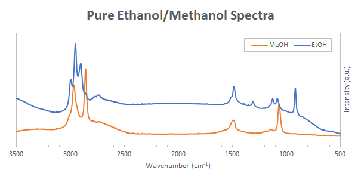
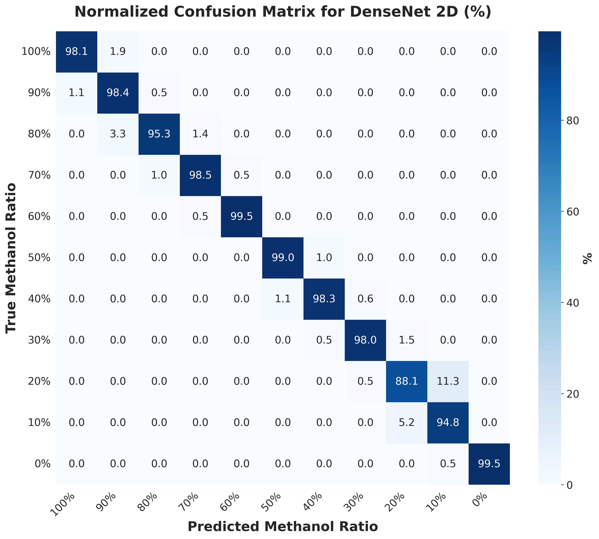
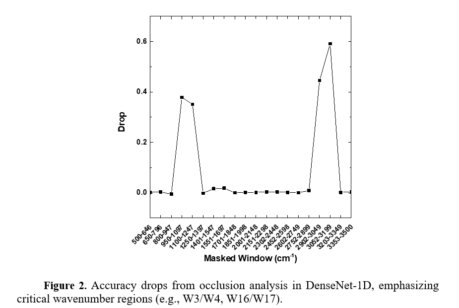
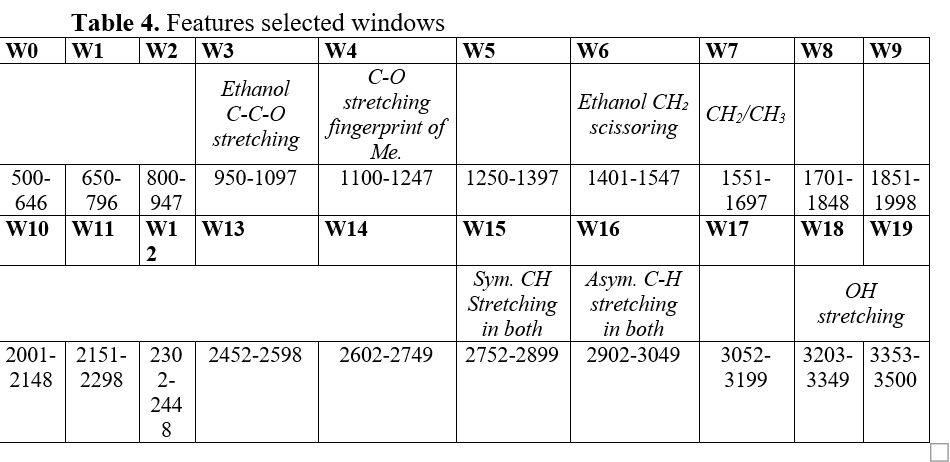

# Raman Spectroscopy Fake Alcohol Detection

[](https://python.org)
[](https://tensorflow.org)

A deep learning pipeline for detecting counterfeit alcohol using Raman spectroscopy and convolutional neural networks. This project compares 1D spectral analysis with 2D time-series imaging (GADF) approaches using DenseNet and ResNet architectures.

## Overview

Counterfeit alcohol containing methanol poses serious health risks. This project uses Raman spectroscopy combined with deep learning to classify alcohol samples and detect adulteration. The system achieves high accuracy in distinguishing between different ethanol-methanol mixture ratios (0-100% in 10% increments).

### Key Features

- **Baseline Correction**: airPLS algorithm for removing fluorescence background
- **Data Augmentation**: Synthetic spectrum generation with noise, shift, and stretch
- **Dual Approach**: Compare 1D spectral vs 2D GADF image classification
- **Multiple Architectures**: DenseNet and ResNet models for both 1D and 2D inputs
- **Interpretability**: Occlusion analysis to identify important spectral regions

## Project Structure

```
Raman-Spectroscopy-CNN-2D/
├── README.md                 # This file
├── requirements.txt          # Python dependencies
├── .gitignore
│
├── src/                      # Source code modules
│   ├── __init__.py
│   ├── preprocessing.py      # Baseline correction, normalization, augmentation
│   ├── models.py             # DenseNet, ResNet architectures
│   ├── transforms.py         # GADF transformation
│   ├── visualization.py      # Plotting functions
│   └── utils.py              # Data loading, training utilities
│
├── notebooks/                # Jupyter notebooks
│   └── main_pipeline.ipynb   # first draft code (messy ah)
│   └── demo.ipynb   # demo for DenseNet 1D only
│
├── data/                     # Data directory
│   ├── Ethanol/              # Raw ethanol spectra
│   ├── Methanol/             # Raw methanol spectra
│   ├── Ethanol_Methanol.xlsx # Mixture spectra dataset
│   ├── synthetic/            # Generated synthetic data
│   ├── maps/                 # GADF transformed images
│   └── labels/               # Label files
│
├── experiments/              # Training experiment results
├── models/                   # Saved trained models
└── outputs/                  # Generated visualizations
```

## Installation

1. Clone the repository:
```bash
git clone https://github.com/SisypheanHUS/Raman-Spectroscopy-CNN-2D
cd /Raman-Spectroscopy-CNN-2D
```

2. Create a virtual environment (recommended):
```bash
python -m venv venv
source venv/bin/activate  # Linux/Mac
venv\Scripts\activate     # Windows
```

3. Install dependencies:
```bash
pip install -r requirements.txt
```

## Quick Start

### Using the Source Modules

```python
from src.preprocessing import airPLS, normalize_spectrum
from src.models import build_1d_densenet, build_2d_densenet
from src.transforms import create_gadf_map
from src.utils import load_excel_data, set_seed

# Set seed for reproducibility
set_seed(42)

# Load and preprocess data
wavenumbers, spectra = load_excel_data('data/Ethanol_Methanol.xlsx')

# Apply baseline correction
corrected = airPLS(spectra['sample1'])
normalized = normalize_spectrum(corrected)

# Create GADF image for 2D classification
gadf_image = create_gadf_map(normalized, image_size=64)

# Build and train model
model = build_1d_densenet(input_shape=(880, 1), num_classes=11)
model.compile(optimizer='adam', loss='sparse_categorical_crossentropy', metrics=['accuracy'])
```

### Running the Full Pipeline

Open and run `notebooks/main_pipeline.ipynb` for the complete training workflow including:
1. Data loading and preprocessing
2. Synthetic data generation
3. GADF transformation
4. Model training (4 architectures)
5. Evaluation and visualization

## Model Architectures

| Model | Input | Description |
|-------|-------|-------------|
| DenseNet 1D | 880×1 spectrum | Dense blocks with feature concatenation |
| DenseNet 2D | 64×64 GADF | 2D dense blocks for image features |
| ResNet 1D | 880×1 spectrum | Residual blocks with skip connections |
| ResNet 2D | 64×64 GADF | 2D residual blocks for spatial features |

## Data Format

### Input Spectra
- **Wavenumber range**: 101-3999 cm⁻¹
- **Resolution**: 0.5 cm⁻¹ step
- **Points**: 880 after interpolation
- **Format**: .txt files (wavenumber, intensity) or Excel

### Classes
11 classes representing ethanol concentration:
- 0% (pure methanol) to 100% (pure ethanol) in 10% increments

## Results

The models achieve high classification accuracy on the test set.
### Sample Spectra 


### Confusion Matrix (DenseNet 2D)


### Accuracy Drop


### Selected Window


See the `experiments/` folder for detailed training logs and more confusion matrices.

## Key Algorithms

### airPLS Baseline Correction
Adaptive Iteratively Reweighted Penalized Least Squares removes fluorescence background while preserving Raman peaks.

### GADF Transformation
Gramian Angular Difference Field converts 1D time series to 2D images, encoding temporal correlations for CNN analysis.


